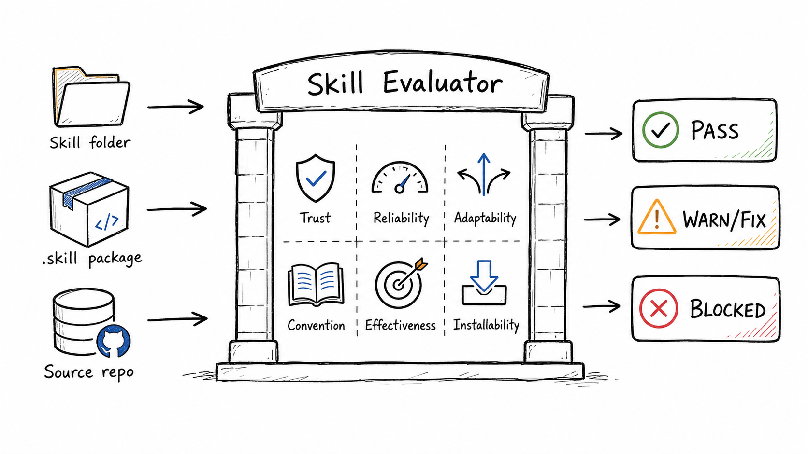
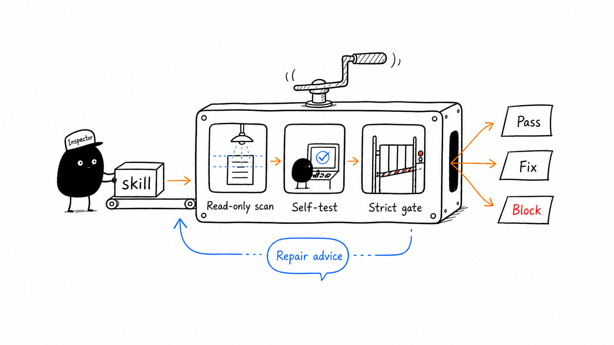

<div align="center">

# Skill Evaluator

Production-grade quality gate for portable AI agent skills.

Use it for release checks, pre-install reviews, quality audits, and practical repair planning.

[简体中文](./README.md) | [English](./README.en.md)


</div>



## What It Solves

`skill-evaluator` is a read-only quality gate for portable AI agent skills. It audits:

- installed skill folders
- skill folders inside source repositories
- `.skill` or `.zip` packages

It does not execute the target skill's business logic. It checks structure, risks, trigger quality, script readiness, release evidence, and returns the smallest useful repair suggestions.

## Six Gates

| Gate | Checks |
| --- | --- |
| Trust | Permissions, credentials, network access, file writes, and production-system risks |
| Reliability | Script syntax, runnable entrypoints, self-tests, and failure paths |
| Adaptability | Frontmatter trigger quality and clear capability boundaries |
| Convention | Layout, frontmatter, resource references, and progressive disclosure |
| Effectiveness | Whether the skill helps complete the job instead of adding more explanation |
| Installability | Clean install, discovery, packaging, and verification |

## Audit Workflow



## Quick Start

```bash
git clone https://github.com/wuhanjieyue/skill-evaluator.git
mkdir -p /path/to/agent-skills
cp -R skill-evaluator/skill-evaluator /path/to/agent-skills/skill-evaluator
```

After installation, refresh or restart the target agent session according to that agent's skill-loading rules.

## Verification

```bash
python3 /path/to/agent-skills/skill-evaluator/scripts/audit_skill.py --self-test
python3 /path/to/agent-skills/skill-evaluator/scripts/audit_skill.py --strict /path/to/agent-skills/skill-evaluator
```

Expected results:

- `--self-test` prints four `SELFTEST PASS` lines
- `--strict` prints `SUMMARY status PASS`
- If the target platform has its own validator, run that validator as an additional platform-specific check

## Usage

Ask any agent that has this skill installed:

```text
Use the skill-evaluator skill to audit /path/to/skill for production readiness.
```

You can also run the script directly:

```bash
python3 skill-evaluator/scripts/audit_skill.py --strict /path/to/skill
python3 skill-evaluator/scripts/audit_skill.py --json --strict /path/to/skill
python3 skill-evaluator/scripts/audit_skill.py --strict /path/to/package.skill
```

## Output

| Status | Meaning |
| --- | --- |
| PASS | The check passed |
| WARN | Production risk; strict mode blocks release |
| FAIL | Baseline requirement is missing |
| FIX | Smallest suggested repair for the issue |
| SUMMARY status PASS | Strict gate passed |
| SUMMARY status BLOCKED | Fix before publishing |

## Release Standard

A skill should be considered production-ready only when:

- `audit_skill.py --strict` passes
- `audit_skill.py --self-test` passes
- The target platform's own validator passes, if that platform provides one
- Network, credential, write, or production-system dependencies are documented and verifiable
- Core behavior has been checked with realistic tasks or fresh-session prompts

## Repository Layout

```text
.
├── README.md
├── README.en.md
├── LICENSE
├── assets/
│   └── readme/
└── skill-evaluator/
    ├── SKILL.md
    ├── agents/
    │   └── openai.yaml
    └── scripts/
        └── audit_skill.py
```

## Compatibility

- The core audit script only depends on the Python standard library
- `agents/openai.yaml` is optional platform metadata, not a universal installation requirement
- No fixed skill installation directory is required; copy it wherever your target agent discovers skills
- The target skill's business logic is not executed, so the audit is safe for pre-release review

## License

MIT License.
