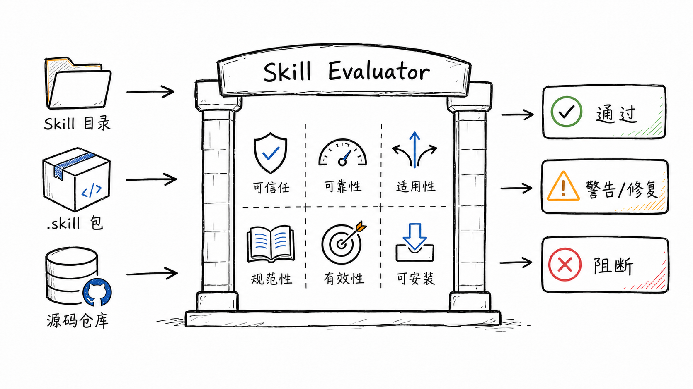
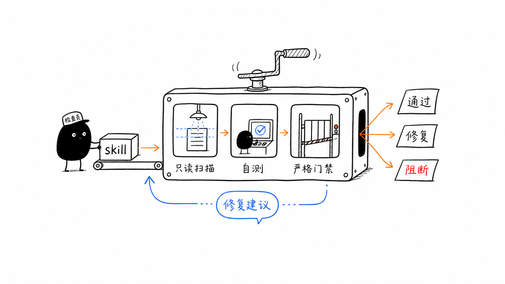

<div align="center">

# Skill Evaluator

把 AI Agent Skill 从“能用”拉到“可发布”的生产级验收门禁。

适用于发布前审计、安装前评估、质量复盘和修复建议生成。

[简体中文](./README.md) | [English](./README.en.md)


</div>



## 它解决什么

`skill-evaluator` 是一个面向可移植 AI Agent Skill 的只读质量门禁。它可以审计：

- 已安装的 skill 目录
- 源码仓库里的 skill 目录
- `.skill` 或 `.zip` 打包文件

它不会执行被测 skill 的业务逻辑，只检查结构、风险、触发描述、脚本可运行性和发布证据，并给出最小修复建议。

## 六项门禁

| 维度 | 检查重点 |
| --- | --- |
| Trust | 权限、凭据、网络、文件写入、生产系统风险是否清楚 |
| Reliability | 脚本语法、可运行入口、自测、失败路径是否可靠 |
| Adaptability | frontmatter 描述是否能稳定触发，边界是否明确 |
| Convention | 目录结构、frontmatter、资源引用、渐进披露是否清晰 |
| Effectiveness | 是否能真正完成目标，而不是只输出更多说明 |
| Installability | 能否干净安装、发现、打包并重新验收 |

## 审计流程



## 快速开始

### 通过 Agent 自动安装

将下面的指令直接发送给你的 AI 工具（如 Cursor、Codex、Claude Code、TRAE），让它根据当前工具的 skill 目录完成安装：

```text
请帮我安装这个 skill：https://github.com/wuhanjieyue/skill-evaluator
安装完成后，请运行自测和严格验收，确认它可以正常使用。
```

安装后按目标 Agent 的规则刷新或重启会话，让 skill 列表重新加载。

### 手动安装

```bash
git clone https://github.com/wuhanjieyue/skill-evaluator.git
mkdir -p /path/to/agent-skills
cp -R skill-evaluator/skill-evaluator /path/to/agent-skills/skill-evaluator
```

不同 Agent 的 skill 目录不同；把 `skill-evaluator/` 子目录复制到目标 Agent 能发现的目录即可。

## 验收

```bash
python3 /path/to/agent-skills/skill-evaluator/scripts/audit_skill.py --self-test
python3 /path/to/agent-skills/skill-evaluator/scripts/audit_skill.py --strict /path/to/agent-skills/skill-evaluator
```

期望结果：

- `--self-test` 输出 4 项 `SELFTEST PASS`
- `--strict` 输出 `SUMMARY status PASS`
- 如果目标平台提供专属 validator，再额外运行该平台的校验命令

## 使用

把目标 skill 路径交给已安装该 skill 的 Agent：

```text
使用 skill-evaluator 评估 /path/to/skill 是否达到生产可用标准
```

也可以直接运行脚本：

```bash
python3 skill-evaluator/scripts/audit_skill.py --strict /path/to/skill
python3 skill-evaluator/scripts/audit_skill.py --json --strict /path/to/skill
python3 skill-evaluator/scripts/audit_skill.py --strict /path/to/package.skill
```

## 输出含义

| 状态 | 含义 |
| --- | --- |
| PASS | 检查项通过 |
| WARN | 存在生产级风险；严格模式下会阻断发布 |
| FAIL | 基础要求不满足 |
| FIX | 对应问题的最小修复建议 |
| SUMMARY status PASS | 严格门禁通过 |
| SUMMARY status BLOCKED | 需要修复后再发布 |

## 发布标准

一个 skill 只有在以下条件满足时才应视为生产可用：

- `audit_skill.py --strict` 通过
- `audit_skill.py --self-test` 通过
- 目标平台自己的 validator 通过，如果该平台提供
- 没有未解释的网络、凭据、写入或生产系统依赖
- 核心行为经过真实任务或 fresh-session prompt 验证

## 仓库结构

```text
.
├── README.md
├── README.en.md
├── LICENSE
├── assets/
│   └── readme/
└── skill-evaluator/
    ├── SKILL.md
    ├── agents/
    │   └── openai.yaml
    └── scripts/
        └── audit_skill.py
```

## 兼容性说明

- 核心审计脚本只依赖 Python 标准库
- `agents/openai.yaml` 是可选平台元数据，不是通用安装前提
- 不要求固定的 skill 安装目录；复制到目标 Agent 能发现的目录即可
- 不执行目标 skill 业务逻辑，适合发布前只读审计

## 许可证

MIT License。
